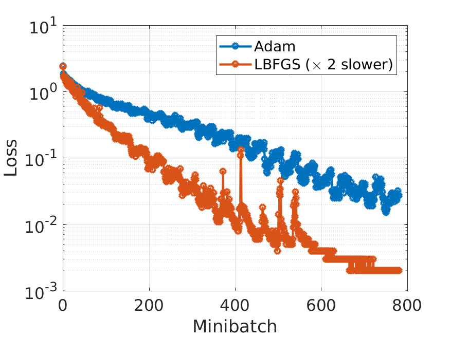
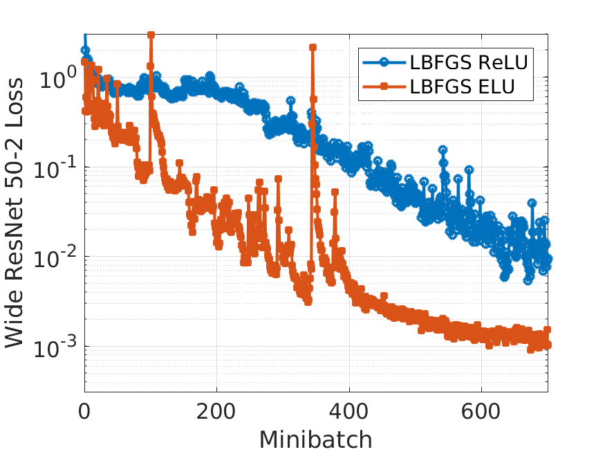
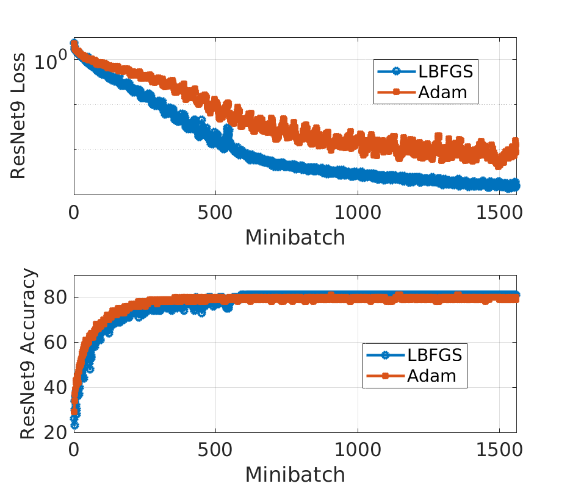

# LBFGS optimizer
An improved LBFGS (and LBFGS-B) optimizer for PyTorch is provided with the code. Further details are given [in this paper](https://ieeexplore.ieee.org/document/8755567). Also see [this introduction](http://sagecal.sourceforge.net/pytorch/index.html).

Examples of use:

  * Federated learning: see [these examples](https://github.com/SarodYatawatta/federated-pytorch-test).

  * Calibration and other inverse problems: see [radio interferometric calibration](https://github.com/SarodYatawatta/calibration-pytorch-test).

  * K-harmonic means clustering: see [LOFAR system health management](https://github.com/SarodYatawatta/LSHM). 

  * Other problems: see [this example](https://ieeexplore.ieee.org/abstract/document/8588731).

Files included are:

``` lbfgsnew.py ```: New LBFGS optimizer

``` lbfgsb.py ```: LBFGS-B optimizer (with bound constraints)

``` cifar10_resnet.py ```: CIFAR10 ResNet training example (see figures below)

``` kan_pde.py ```: Kolmogorov Arnold network PDE example using LBFGS-B



The above figure shows the training loss and training time [using Colab](https://colab.research.google.com/notebooks/intro.ipynb) with one GPU. ResNet18 and ResNet101 models are used. Test accuracy after 20 epochs: 84% for LBFGS and 82% for Adam.

Changing the activation from commonly used ```ReLU``` to others like ```ELU``` gives faster convergence in LBFGS, as seen in the figure below.



Here is a comparison of both training error and test accuracy for ResNet9 using LBFGS and Adam.



Example usage in full batch mode:

```
from lbfgsnew import LBFGSNew
optimizer = LBFGSNew(model.parameters(), history_size=7, max_iter=100, line_search_fn=True, batch_mode=False)
```

Example usage in minibatch mode:

```
from lbfgsnew import LBFGSNew
optimizer = LBFGSNew(model.parameters(), history_size=7, max_iter=2, line_search_fn=True, batch_mode=True)
```

Note: for certain problems, the gradient can also be part of the cost, for example in TV regularization. In such situations, give the option ```cost_use_gradient=True``` to ```LBFGSNew()```. However, this will increase the computational cost, so only use when needed.
